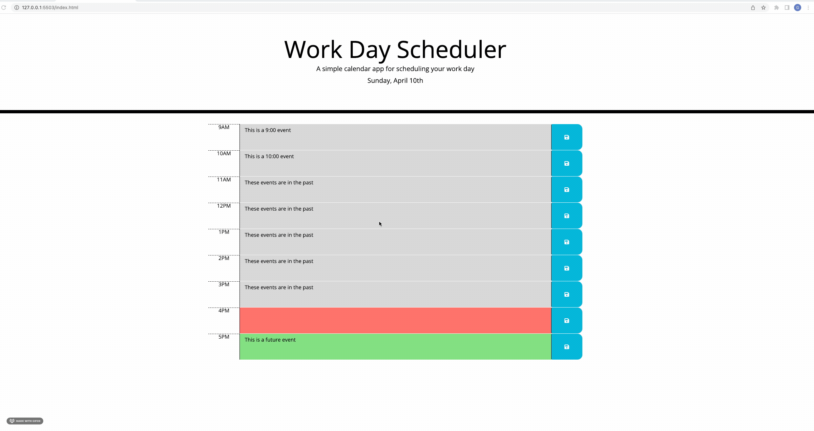

# Work Day Scheduler

[Description](#decription)

[Built With](#built-with)

[Link](#link)

[Screenshot](#screenshot-of-home-page)
## Description 

This week I was assigned a project to create a Work Day Scheduler. The CSS was provided beforehand along with basic html setup to get me started. 

In this project, I leveraged bootstrap and jQuery to make a functional work day scheduler. The scheduler represents a normal workday (9am-5pm). This project also allowed me to leverage local storage in order to provide persistent storage to the page and save the event content when the page is refreshed. I also used the moment library to shwo the current day at the top of the calendar. I also leveraged moment to set the time blocks to represent a color associated with a past, prevent, or future event. 

## Built With 

* HTML
* CSS
* Bootstrap
* jQuery 

## Link

URL of the deployed application: https://undisputed06.github.io/work-day-scheduler/
## Screenshot of Home Page

